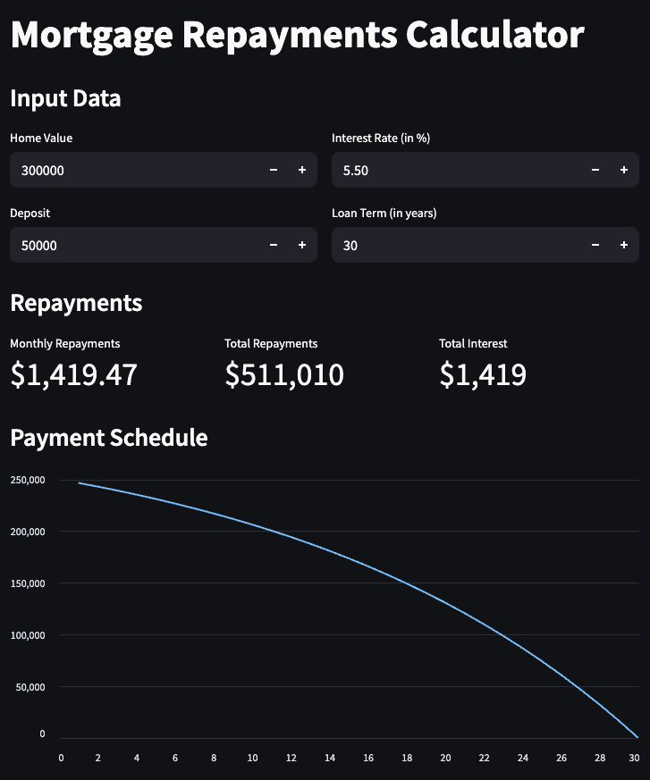

# 🏠 Mortgage Calculator

This project is a simple and interactive **Mortgage Calculator** built using [Streamlit](https://streamlit.io/). It helps users estimate their monthly mortgage payments based on home value, deposit, interest rate, and loan term.

> Inspired by Pixegami's tutorial on YouTube to learn and explore Streamlit for building data apps.

## 🚀 Features

- User-friendly web interface
- Real-time monthly payment calculation
- Input fields for:
  - Home Value
  - Deposit
  - Annual Interest Rate
  - Loan Term (in years)
- Calculates:
  - Monthly Repayments
  - Total Repayment
  - Total Interest Paid

## 📸 Demo

  

## 🛠️ Tech Stack

- 🐍 Python
- 🌐 Streamlit

## 🧮 How it Works

The calculator determines the monthly mortgage payments using the following formula:

```python
loan_amount = home_value - deposit
monthly_interest_rate = (interest_rate / 100) / 12
number_of_payments = loan_term * 12
monthly_payment = (
    loan_amount
    * (monthly_interest_rate * (1 + monthly_interest_rate) ** number_of_payments)
    / ((1 + monthly_interest_rate) ** number_of_payments - 1)
)
```

It also calculates:

```python
total_payments = monthly_payment * number_of_payments
total_interest = total_payments - loan_amount
```

Where:
- loan_amount = home value minus deposit
- monthly_interest_rate = annual interest rate divided by 12
- number_of_payments = total months in the loan term
- monthly_payment = amount to be paid every month
- total_payments = total money paid over the full term
- total_interest = how much interest you paid in total

## 📂 Project Structure
```
.
├── .streamlit               # For adding strealit configurations
    └── config.toml          # configurations file
├── image.png                # Screenshot of the app
├── mortgage_calculator.py   # Main Streamlit app
├── README.md                # Project documentation
└── requirements.txt         # Python dependencies
```

## 💻 Getting Started

1.	Clone the repository


```bash
git clone https://github.com/your-username/mortgage-calculator.git
cd mortgage-calculator
```

2.	Install dependencies


```bash
pip install -r requirements.txt
```

3.	Run the app


```bash
streamlit run mortgage_calculator.py
```

## 📦 Requirements

Make sure Python 3.7 or later is installed.
Dependencies listed in requirements.txt include:

- streamlit
- matplotlib
- pandas

## 📹 Credits
- Tutorial by [Pixegami on YouTube](https://youtu.be/D0D4Pa22iG0?feature=shared) 🎥


Feel free to fork or star the repo if you found it helpful!

Let me know if you'd like to add a logo, animated GIF of the app, or deploy instructions via Streamlit Cloud!